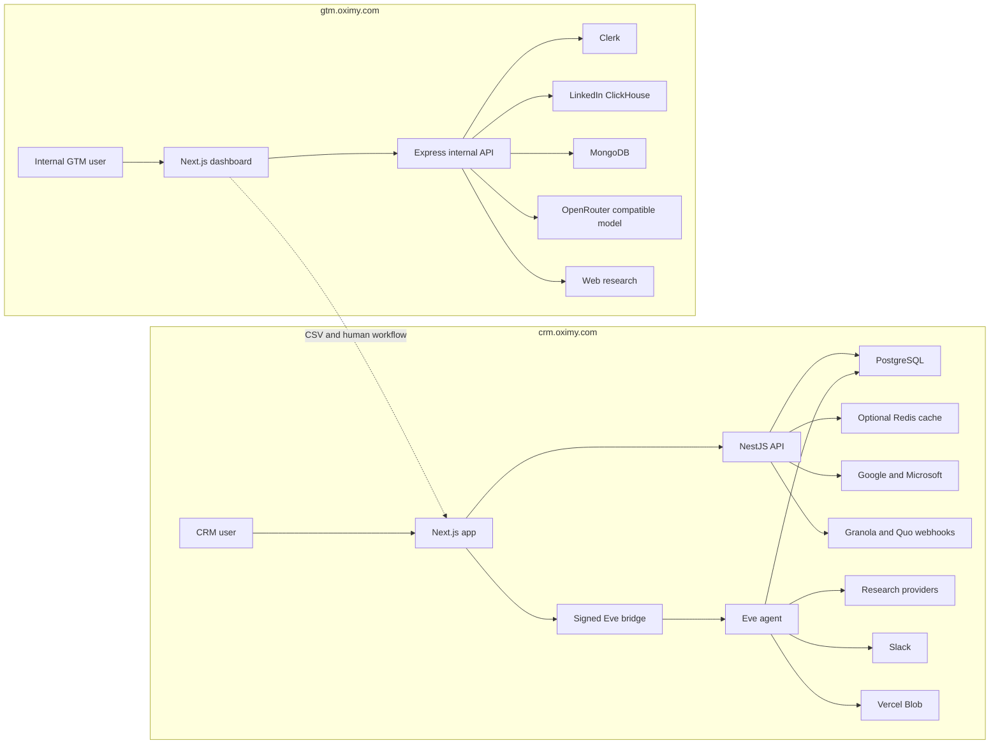
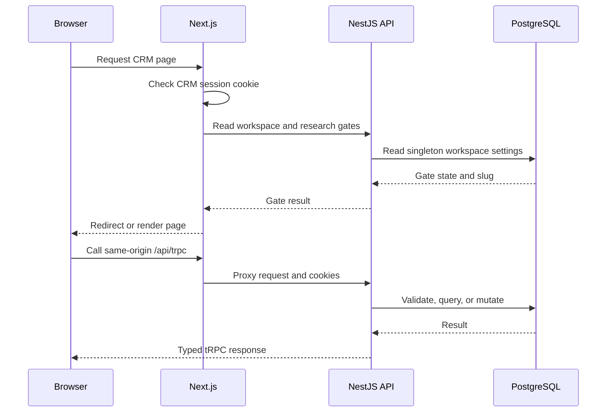
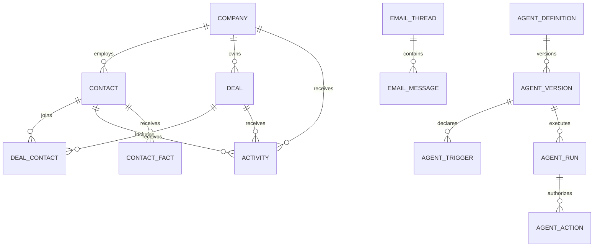
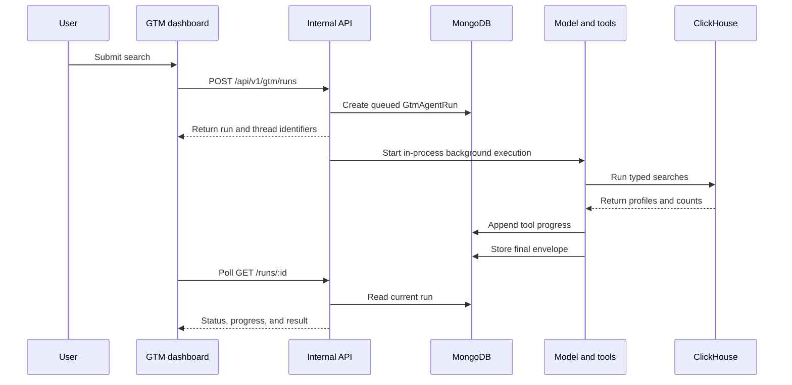

# How `crm.oximy.com` and `gtm.oximy.com` work

## Purpose

This document explains both Oximy sales systems from browser request to stored data.

It covers applications, APIs, agents, data, connectors, security, jobs, and deployment.

It describes repository code, not live production state.

## Source snapshot

| System | Repository | Commit | Snapshot date |
| --- | --- | --- | --- |
| CRM | `/Users/singhcoder/crm` | `312e642ad27c35d10c3282eb0e09a23a82300bef` | 2026-08-17 |
| GTM | `/Users/singhcoder/internal` | `574d65432cc340103c715b9c66909825dba979b9` | 2026-08-18 |

The code confirms the architecture below.

Production environment values, database contents, and platform health remain outside this repository review.

## The short answer

`crm.oximy.com` is the operational CRM for one workspace.

It stores companies, contacts, deals, activities, communications, conversations, and custom agents.

It also ingests mail, calendars, calls, meeting notes, forms, and website activity.

`gtm.oximy.com` is a separate internal prospecting application.

It searches a global LinkedIn dataset and manages qualified leads, saved lists, and search threads.

The two systems do not share an application database or direct runtime integration.

People move between them through human selection and export workflows.

## System ownership

| Surface | Owning repository | Main runtime | Main data stores |
| --- | --- | --- | --- |
| `crm.oximy.com` | `crm` | Next.js, NestJS, Eve | PostgreSQL, optional Redis, Vercel Blob |
| `gtm.oximy.com` | `internal` | Next.js, Express | LinkedIn ClickHouse, MongoDB |
| GTM API | `internal` | Express on Railway | MongoDB, LinkedIn ClickHouse |
| CRM research agent | `crm` | Eve deployment | PostgreSQL, Eve session storage |

## Combined system map



# Part I: `crm.oximy.com`

## Runtime components

### `apps/app`

The Next.js application renders every CRM page.

It owns URL routing, onboarding gates, browser state, query caching, and agent panels.

Authenticated application routes live under the workspace slug.

Examples include `/<slug>/contacts`, `/<slug>/companies`, `/<slug>/deals`, and `/<slug>/agents`.

The slug is cosmetic.

Every server query still uses the singleton `WORKSPACE_ID`.

The application proxies `/api/*` requests to the NestJS API.

The application proxies `/eve/v1/*` requests to the Eve deployment.

### `apps/api`

The NestJS API owns HTTP, Better Auth, tRPC, mailbox sync, webhooks, caching, and persistence services.

The API does not perform research, enrichment, scoring, or identity decisions.

The API records durable work as `AgentTask` rows.

The agent later claims those rows.

### `apps/agent`

The Eve application owns all intelligent work.

It runs as a separate deployment.

It contains tools, skills, channels, schedules, hooks, subagents, and a restricted sandbox.

The sandbox has no database credentials.

The sandbox also uses deny-all network egress.

Authored tools provide controlled CRM and external access.

### Shared packages

| Package | Responsibility |
| --- | --- |
| `@crm/db` | Prisma schema, PostgreSQL client, domain constants, Blob helpers |
| `@crm/auth` | Better Auth, OAuth providers, workspace roles, Slack grants |
| `@crm/ui` | Shared shadcn components and theme |
| `@crm/env` | Root environment loading |
| `@crm/validation` | Shared Zod contracts |
| `@crm/telemetry` | Server telemetry allowlist and PostHog client |

## Browser request flow



The proxy sends unauthenticated users to `/sign-in`.

It sends new users through workspace onboarding.

It then requires the research key screen.

An unreachable API fails these gates open.

Record pages resolve the real session on the server.

## Authentication and workspace model

Better Auth handles Google, Microsoft, and configured OpenID Connect providers.

`ALLOWED_SIGN_IN` restricts account creation by exact address or domain.

An empty allowlist blocks all new accounts.

The first account becomes the workspace owner.

Later sign-ins join the singleton workspace automatically.

Roles control workspace, connections, currency, tracking, SSO, and field administration.

The last owner cannot lose the owner role.

Google and Microsoft accounts can also provide mailbox permissions.

An SSO-only user does not require mailbox access.

## CRM data model

PostgreSQL is the system of record.

The Prisma schema contains six main data groups.

| Group | Important models | Purpose |
| --- | --- | --- |
| Identity | `User`, `Session`, `Account`, `Member`, `Organization`, `SsoProvider` | Authentication and workspace membership |
| CRM | `Company`, `Contact`, `ContactPhone`, `Deal`, `DealContact`, `Activity` | Sales records and work history |
| Communications | `Communication`, `EmailThread`, `EmailMessage`, `CalendarEvent`, `QuoWebhookEvent` | Mail, meetings, calls, and messages |
| Agent | `AgentTask`, `AgentEvent`, `AgentConversation`, `AgentDefinition`, `AgentVersion`, `AgentRun` | Research, chat, custom agents, and audits |
| Customization | `FieldDefinition`, `FieldOption`, `FieldValue`, `AppSetting`, `WorkspaceProfile` | Fields, configuration, and company identity |
| Tracking | `TrackedVisitor`, `TrackedEvent`, `FormSubmission`, `TrackedPageDaily` | Website activity and attribution |

### Core record relationships



## Main CRM data lifecycle

### Manual changes

The browser calls generated tRPC procedures.

Routers validate inputs and call services.

Services enforce permissions and write through Prisma.

The UI invalidates affected query families after success.

Deletes are permanent.

Contact deletion also creates an address suppression.

This suppression prevents mailbox or form ingestion from recreating that contact.

### Gmail and Outlook

One provider account supplies sign-in and delegated mailbox access.

Gmail sync advances from a Google history identifier.

Outlook sync advances from a received timestamp with a one-second overlap.

Both providers normalize messages into one `IncomingMessage` shape.

`ThreadWriterService` is the only email record writer.

It writes threads, messages, email activities, contacts, and company matches.

RFC message identifiers join conversations across providers when headers exist.

The first connection is forward-only.

It does not import the user's historic mailbox.

### Google Calendar

Calendar sync starts at the connection time.

It files meetings and attendees into CRM records.

It ignores internal, resource, automated, suppressed, and machine addresses.

### Website tracking

The customer places `/t/crm.js` on its marketing site.

The loader reads a site identifier and loads `/t/<siteId>.js`.

The second script contains the current configuration.

It records page views, clicks, and allowed form submissions.

The collector accepts anonymous `POST /api/t/e` requests.

It validates origin, site, visitor, host, bot signals, replay signals, and rate limits.

It never stores IP addresses or URL query strings.

It removes sensitive form fields before storage.

`TrackingFilingService` converts eligible submissions into contacts.

It reuses mailbox suppression and identity rules.

### Granola

An owner or administrator stores a Granola API key.

The connection requires one accessible `Customer Calls` folder.

Connection creates a folder-scoped webhook and queues a full backfill.

The API verifies Standard Webhooks signatures.

It queues direct `granola-note` work.

The agent fetches and parses the note.

Exact attendee emails drive contact matching.

One unambiguous open deal receives the meeting activity.

Ambiguous matches remain on the company for review.

### Quo

An owner or administrator stores the Quo API key.

Connection creates or reconciles the Oximy webhook.

Webhook requests become durable `QuoWebhookEvent` and `AgentTask` rows.

Direct agent tasks fetch Quo contacts or users when required.

They file calls and messages as `Communication` records.

They match known contacts and leave unclear records for review.

Separate sync tasks exchange CRM contact phone data with Quo.

### Slack

Slack is a shared workspace capability.

Connecting a new Slack workspace replaces the previous workspace connection.

The bot token lives on the Better Auth account.

The user token lives in `SlackWorkspaceGrant`.

Public channel joining uses the bot token.

Private channel joining requires the user token.

The agent caches channel and person inventory in PostgreSQL.

Custom agents can post only to approved destinations.

Every action uses a replay key and an action ledger.

## CRM connector matrix

| Connection | Brings in | Sends | Credential owner | Execution owner |
| --- | --- | --- | --- | --- |
| Google | Gmail and Calendar | Nothing | Per user | API sync |
| Microsoft | Outlook mail | Nothing | Per user | API sync |
| Slack | People and channel inventory | Agent messages | Shared workspace | Agent |
| Granola | Customer call notes | Nothing | Shared workspace | API webhook and agent |
| Quo | Calls, messages, contacts | Contact updates | Shared workspace | API webhook and agent |
| Tracking | Page activity and forms | Nothing | Site identifier | Browser and API |
| OpenID Connect | User identity | Nothing | Workspace | Better Auth |
| Remote MCP | CRM reads and writes | Client-requested changes | Per OAuth client | API and agent |

Connections provide capabilities.

Custom agents define automation.

Connection settings never define triggers or workflows.

## The CRM research agent

### Durable task queue

API events create `AgentTask` rows.

The row survives agent downtime.

`claimDue` uses row locks and `SKIP LOCKED`.

Multiple dispatchers therefore claim different tasks.

Each task has priority, due time, attempts, lease, and outcome.

The API also sends a fire-and-forget dispatch poke.

The schedule remains the production backstop.

### Direct and research lanes

| Lane | Examples | Model use |
| --- | --- | --- |
| Direct | Brands, portraits, Slack inventory, Granola, Quo, CRM events | None |
| Research | Identity, profiles, meeting preparation, company research | One Eve session |

Direct work uses deterministic code.

Research work uses authored tools and evidence rules.

The default model is stored in `AppSetting`.

The current compiled fallback is `zai/glm-5.2-fast`.

### Evidence model

Tools report observations instead of model confidence.

`lib/evidence.ts` assigns evidence strength.

`lib/facts.ts` is the only contact fact writer.

Strong evidence can fill or update fields.

Weaker evidence becomes a reviewable suggestion when existing data could be lost.

The agent never overwrites a human value without the required evidence path.

### Interactive record conversations

Each contact, company, and deal can open an Agent tab.

Next.js verifies the Better Auth session.

It removes the browser cookie before forwarding.

It mints a two-minute signed token containing the user and record identifiers.

Eve maps that token to a user principal.

`AgentConversation` stores the session handle.

`AgentEvent` stores the CRM audit transcript.

Eve retains the durable session stream.

### Custom agent builder and runner

The builder creates immutable agent versions from a private conversation.

Version manifests declare triggers, record scope, sources, actions, and destinations.

Saving creates a `READY` version.

A human deployment pins that immutable version.

CRM events create durable `agent-event` tasks.

The agent matches active triggers and creates `AgentRun` rows.

The runner revalidates scope and permissions for every tool.

Actions use `AgentAction` rows for authorization and replay safety.

Cancellation settles the database row first.

An agent cancellation request only reduces further model spend.

Completed external actions remain completed.

## CRM jobs and retention

| Schedule | Route or owner | Purpose |
| --- | --- | --- |
| Every five minutes | `/internal/sync/mailboxes` | Gmail, Calendar, and Outlook sync |
| Daily at 06:00 | `/internal/sync/rates` | Exchange-rate refresh |
| Daily at 07:00 | `/internal/telemetry/rollup` | Install telemetry rollup |
| Daily at 04:00 | `/internal/tracking/retention` | Tracking rollup and retention |
| Eve schedule | `schedules/dispatch.ts` | Agent task dispatch and blank fact sweep |

`CRON_SECRET` protects all anonymous internal cron routes.

The tracking retention job rolls whole UTC days before deletion.

## CRM money handling

`amount` and `currency` preserve the sold amount.

`baseAmount` is the only amount used for sums and charts.

The conversion rate is frozen when the deal changes.

Missing rates exclude the deal from sums and produce a visible warning count.

Reporting currency lives in `AppSetting`.

## CRM remote MCP

The CRM exposes Streamable HTTP MCP at `https://crm.oximy.com/api/mcp`.

Better Auth acts as the OAuth authorization server.

MCP clients receive CRM tokens, not Google tokens.

Scopes separate read, write, agent, delete, admin, and offline access.

The MCP reuses CRM services and validation.

Intelligent MCP tools queue agent work.

# Part II: `gtm.oximy.com`

## Runtime components

### `apps/gtm-dashboard`

The Next.js dashboard runs on Vercel.

It uses React, Clerk, TanStack Query, and TanStack Virtual.

Its production domain is `gtm.oximy.com`.

`NEXT_PUBLIC_API_URL` points it at `internal-api.oximy.com`.

All API calls pass through `src/lib/api.ts`.

### `apps/api`

The internal Express API runs separately, normally on Railway.

It mounts GTM routes at `/api/v1/gtm/*`.

It connects to MongoDB during boot.

It also initializes the LinkedIn ClickHouse client.

### Unrelated internal applications

The internal repository also contains `internal-dash`, `worker`, `docs`, and `parser-daemon`.

Those applications support other Oximy internal systems.

They do not serve the main GTM dashboard request path.

The internal API shares vendored Oximy packages with those systems.

## GTM authentication

Clerk authenticates the browser and API request.

Every GTM route runs `requireGtmAccess`.

The middleware loads the Clerk user through the backend API.

It requires `publicMetadata.gtm_access`.

The GTM application has no organization context.

Lists and agent runs are private to the Clerk user.

Qualified leads and ICP configuration are global to the internal tool.

## GTM pages

| Route | Purpose |
| --- | --- |
| `/` | Natural-language search and threaded runs |
| `/leads` | Qualified lead explorer and export |
| `/lists` | Personal saved prospect lists |
| `/lists/[id]` | List detail and people management |
| `/icp` | Editable title tiers and keywords |
| `/sign-in` | Clerk sign-in |

## GTM data stores

### LinkedIn ClickHouse

The current search surface reads `gtm_people`.

This table contains hundreds of millions of denormalized profile rows.

Scalar columns include identity, location, current role, current company, and audience counts.

Pre-lowered text columns support token searches.

Current role queries use `current_title`.

Current company queries use `current_company` or `current_company_id`.

Former employer queries use `past_companies_text`.

Historic title queries use `all_titles_text`.

Single-person detail reads the larger `profiles` table.

That query returns current roles, work history, education, languages, and websites.

### MongoDB

| Collection model | Scope | Purpose |
| --- | --- | --- |
| `GtmAgentRun` | Per Clerk user | Search runs, threads, progress, and results |
| `GtmList` | Per Clerk user | Saved profile identifiers and list metadata |
| `GtmLead` | Global | Qualified prospects and audit evidence |
| `GtmIcpConfig` | Global | Editable ICP tiers and title keywords |

`GtmLead` is self-contained.

The leads page therefore needs no ClickHouse join.

## Structured GTM search

`GET /people` accepts validated filters.

The service builds parameterized ClickHouse SQL.

It uses token indexes for names, titles, companies, education, skills, certificates, and languages.

It supports country, city, state, industry, size, connection, and follower filters.

It uses keyset pagination.

Search scans omit `FINAL` for latency.

The service removes duplicate profile identifiers from returned rows.

`GET /people/:id` reads complete details from `profiles`.

Filter options use a fifteen-minute process cache.

## GTM search agent

The GTM agent lives inside the Express API.

It is not the Eve CRM agent.

The model uses an OpenRouter-compatible chat completion API.

`GTM_AGENT_MODEL` selects the model.

The current default is `google/gemini-3-flash-preview`.

### Preferred operations

| Operation | Purpose |
| --- | --- |
| `count_estimate` | Reject or narrow broad searches |
| `resolve_location` | Convert informal places into search regions |
| `resolve_company` | Resolve a company into current company identifiers |
| `people_search` | Find profiles with typed filters |
| `company_prospects` | Rank current employees by ICP tier |
| `leads_query` | Search the qualified lead collection |
| `lists_query` | Read the user's saved lists |
| `web_research` | Add current web facts and citations |
| `get_schema` | Inspect permitted schemas |
| `execute_search` | Run validated read-only fallback SQL |

Typed operations bind values as parameters.

Raw SQL is a discouraged fallback.

The fallback validator blocks mutation keywords, unsafe tables, missing limits, and unapproved shapes.

The final response groups people by ICP tier and adjacency type.

## GTM background search runs



Runs group into threads.

Follow-up runs rebuild conversation history from completed runs.

Runs in one thread execute serially.

Different threads can execute concurrently.

The API limits active runs per user and global process concurrency.

Heartbeat updates distinguish active work from interrupted work.

Read requests mark stale work as interrupted.

## Qualified leads

The qualification pipeline starts from title and metro candidates in ClickHouse.

Company research uses grounded Gemini work outside the dashboard request path.

Per-person qualification creates structured verdicts, evidence, risks, and recommendations.

Import scripts write completed records into `GtmLead`.

The final verdict preserves the raw model verdict and deterministic overrides.

The leads API supports facets, filters, selection, sorting, identifiers, and CSV export.

The dashboard shows why each lead qualified.

## Saved lists

Each list belongs to one Clerk user.

It stores LinkedIn person identifiers and a derived count.

Users can create lists manually or from a search.

Users can add or remove people.

Deletion is soft.

Exports hydrate selected profiles and return CSV.

## ICP configuration

One global MongoDB document stores ordered ICP tiers.

Each tier contains a number, label, and title keywords.

The `/icp` page edits this configuration.

Company prospect searches use the live configuration.

The service falls back to compiled draft tiers after a read failure.

## GTM API surface

| Area | Endpoints |
| --- | --- |
| People | `GET /people`, `GET /people/:id`, `GET /filters` |
| Agent | `POST /ask/v2`, `POST /ask/v2/stream` |
| Runs | `POST /runs`, `GET /runs/:id` |
| Threads | `GET /threads`, `GET /threads/:id`, `DELETE /threads/:id` |
| Lists | Create, read, update, delete, create-from-search, export |
| ICP | `GET /icp`, `PUT /icp` |
| Leads | List, stats, identifiers, and export |
| Search export | `POST /export` |

## GTM deployment

The internal repository uses `pnpm` and Turborepo.

CI runs lint, typecheck, and build jobs by changed application.

The GTM production workflow runs on `main` changes under `apps/gtm-dashboard`.

It pulls the Vercel production environment.

It builds and deploys the prebuilt dashboard to Vercel.

The internal API deployment configuration lives outside the reviewed GitHub workflow.

# Part III: Boundaries and operations

## CRM and GTM boundary

No code path directly inserts a GTM profile into the CRM.

No shared identifier contract joins `GtmLead.person_id` to a CRM contact.

No GTM connector appears on the CRM connections page.

No CRM connector appears in the GTM dashboard.

The practical transfer path is CSV export or manual record creation.

That boundary prevents prospecting data from silently becoming operational customer data.

It also prevents CRM suppressions and ownership rules from applying during GTM search.

## Deployment comparison

| Concern | CRM | GTM |
| --- | --- | --- |
| Frontend | Vercel Next.js | Vercel Next.js |
| API | Vercel NestJS function | Railway Express service |
| Agent | Separate Eve deployment | In-process Express service |
| Primary database | PostgreSQL | MongoDB and ClickHouse |
| Authentication | Better Auth | Clerk |
| Shared cache | Optional Redis | Process caches and MongoDB |
| Release branch | `release` | `main` |

## Local development

### CRM

```sh
cp .env.example .env
docker compose up -d
bun run db:migrate
bun run db:seed
bun run dev
```

The CRM app listens on port 3000.

The CRM API listens on port 3001.

The Eve agent listens on port 2000.

### GTM

```sh
cd /Users/singhcoder/internal
pnpm install
pnpm --filter @oximy/internal-api dev
pnpm --filter gtm-dashboard dev
```

The GTM dashboard defaults to port 3000.

The internal API defaults to the configured service port.

The dashboard expects `http://localhost:4000` without an override.

## Security and privacy summary

| Control | CRM | GTM |
| --- | --- | --- |
| User gate | Allowlist and Better Auth | Clerk plus `gtm_access` metadata |
| Data scope | Singleton workspace | Global leads, personal runs and lists |
| Agent database access | Authored tools only | API services and typed operations |
| Raw SQL | No user surface | Validated fallback only |
| Browser secrets | Same-origin proxies | Clerk bearer token to internal API |
| Customer content logging | Prohibited | API logs tool shapes and selected query details |
| Website IP storage | Prohibited | Not applicable |
| External actions | Manifest permissions and action ledger | Search and export only |

## Source map

### CRM

| Topic | Primary source |
| --- | --- |
| Overall application | `README.md` |
| API architecture | `docs/api.md`, `apps/api/src/app.module.ts` |
| Agent | `docs/agent.md`, `apps/agent/agent/` |
| Data | `packages/db/prisma/schema.prisma` |
| Connections | `docs/connections.md` |
| Tracking | `docs/tracking.md` |
| Environment | `docs/environment.md` |
| Deployment | `docs/setup.md`, `CONTRIBUTING.md` |
| MCP | `docs/mcp.md` |

### GTM

| Topic | Primary source |
| --- | --- |
| Dashboard | `apps/gtm-dashboard/src/` |
| API routes | `apps/api/src/routes/gtm.routes.ts` |
| Search | `apps/api/src/services/gtm/gtm-search.service.ts` |
| Agent | `apps/api/src/services/gtm/gtm-agent.service.ts` |
| Typed operations | `apps/api/src/services/gtm/operations/` |
| Runs | `apps/api/src/services/gtm/gtm-run.service.ts` |
| Mongo models | `vendor/oximy/packages/db/src/mongodb/models/gtm-*.model.ts` |
| Deployment | `.github/workflows/gtm-dashboard-deploy.yaml` |

## Known issues

1. RISK — GTM background runs live inside one API process. A restart interrupts active searches.
   Fix: not done. Use a durable worker queue for execution.
2. RISK — GTM agent rate limits use process memory. Horizontal replicas multiply each user's allowance.
   Fix: not done. Move admission state to a shared store.
3. RISK — GTM filter caches use process memory. Replicas return different cache ages.
   Fix: not done. Use a shared cache or accept bounded inconsistency.
4. RISK — CRM caches become per-instance without Redis. Multi-instance reads can remain inconsistent for one cache lifetime.
   Fix: configure `REDIS_URL` for multi-instance deployments.
5. RISK — CRM preview deployments share the production database. Preview schema changes can fail at runtime.
   Fix: not done. Give previews isolated databases.
6. BROKEN — CRM API development does not reload shared package changes. The running API serves stale package code.
   Fix: restart the API after changes under `packages/`.
7. UNKNOWN — Production environment values and platform bindings were not inspected. Repository configuration can differ from production.
   Fix: verify Vercel, Railway, PostgreSQL, MongoDB, ClickHouse, Redis, and Clerk settings separately.
8. UNKNOWN — Production data counts and live connector health were not inspected. Code does not prove current ingestion health.
   Fix: run a separate live operational audit with read-only credentials.
